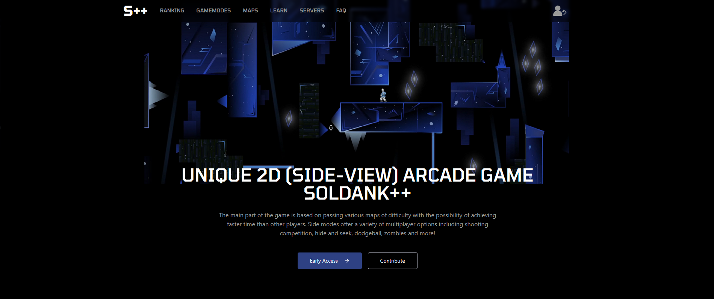

# Soldank++ Website

Frontend for [Soldank++](https://github.com/soldank-plus-plus/soldank-plus-plus) website built with Vite, React, TypeScript, Tailwind CSS, and Shadcn as UI library.
The backend architecture can be found [here](https://github.com/soldank-plus-plus/spp-webstats).

## Screenshot



## Building

1. Make sure you have [Node.js v16](https://nodejs.org/en/download) (or higher) and clone this repository:

```
> git clone https://github.com/soldank-plus-plus/spp-website
> cd spp-website
```

2. Install the dependencies and run the development server:

```
> npm install
> npm run dev
```
