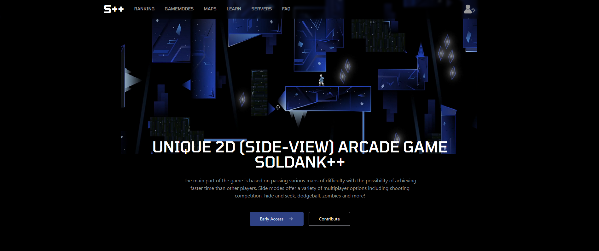

# Soldank++ Website

Frontend for [Soldank++](https://github.com/soldank-plus-plus/soldank-plus-plus) website built with Vite, React, TypeScript, OpenAPI, TanStack, Tailwind CSS, and Shadcn as UI library.
The backend architecture can be found [here](https://github.com/soldank-plus-plus/spp-webstats).

## Screenshot



## Environment variables

Create a `.env.development` (used by `npm run dev`) or `.env` (used by `npm run build`) file with:

```
VITE_API_BASE_URL=http://localhost:3000
```

If unset, the app falls back to `http://localhost:3000`. There is no mock backend, so the app talks to a real [spp-webstats](https://github.com/soldank-plus-plus/spp-webstats) instance, so most pages need one running to show data.

## Dependencies

The project uses the following packages:

- [React](https://react.dev/) + [React Router](https://reactrouter.com/): UI and client-side routing
- [TypeScript](https://www.typescriptlang.org/): static typing
- [Vite](https://vitejs.dev/): dev server and build tool
- [Tailwind CSS](https://tailwindcss.com/) + [shadcn/ui](https://ui.shadcn.com/): styling and UI primitives
- [TanStack Query](https://tanstack.com/query/latest): server state, caching, and loading/error handling for API data
- [openapi-codegen](https://github.com/fabien0102/openapi-codegen): generates typed API clients and React Query hooks from the backend's OpenAPI schema
- [Framer Motion](https://www.framer.com/motion/): animations
- [Recharts](https://recharts.org/): charts (roadmap, account activity)
- [Embla Carousel](https://www.embla-carousel.com/): carousels
- ESLint + Prettier + Husky + lint-staged: linting, formatting, and git hooks

## Setup

### Building

Make sure you have [Node.js v16](https://nodejs.org/en/download) (or higher) and clone this repository:

```
> git clone https://github.com/soldank-plus-plus/spp-website
> cd spp-website
```

### Running

Install the dependencies and run the development server:

```
> npm install
> npm run dev
```

## Backend integration

Typed API clients and React Query hooks for the endpoints the backend documents are generated, not hand-written. To regenerate them after a backend change (with [spp-webstats](https://github.com/soldank-plus-plus/spp-webstats) running locally on port 3000):

```
> npm run generate:api-types
```

This reads the backend's live OpenAPI schema (`http://localhost:3000/api-json`) and writes the result to `src/api/generated/`.
